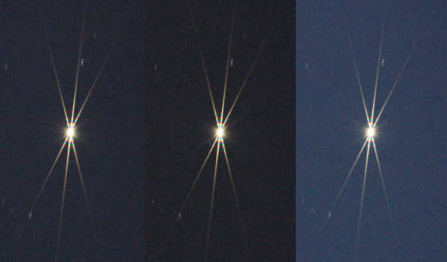

## Description

I recently improved my focusing technique by printing a Bahtinov mask. I used a 3D printer to print the mask, and it works great. I can now focus my telescope much more accurately than before. The mask is easy to use and provides a clear indication of when the telescope is in focus. I highly recommend using a Bahtinov mask for anyone who is serious about astrophotography.

## What is a Bahtinov mask ?

A Bahtinov mask is a focusing aid for astronomy in general, and astrophotography in particular. It consists of a disk with three sets of slits, each set at a different angle. The mask is placed over the front of the telescope, and the telescope is pointed at a bright star. The star's light passes through the slits and creates diffraction spikes. When the telescope is out of focus, the spikes are not symmetrical. When the telescope is in focus, the spikes are symmetrical. The mask is named after its inventor, Russian amateur astrophotographer Pavel Bahtinov.

Here is an example of a Bahtinov mask in action. The spikes are symmetrical, indicating that the telescope is in focus.

In this video you can see how the diffraction spikes move when focusing the telescope. The goal is to get the middle spike in the middle of the other two spikes.

## Sources

https://en.wikipedia.org/wiki/Bahtinov_mask

