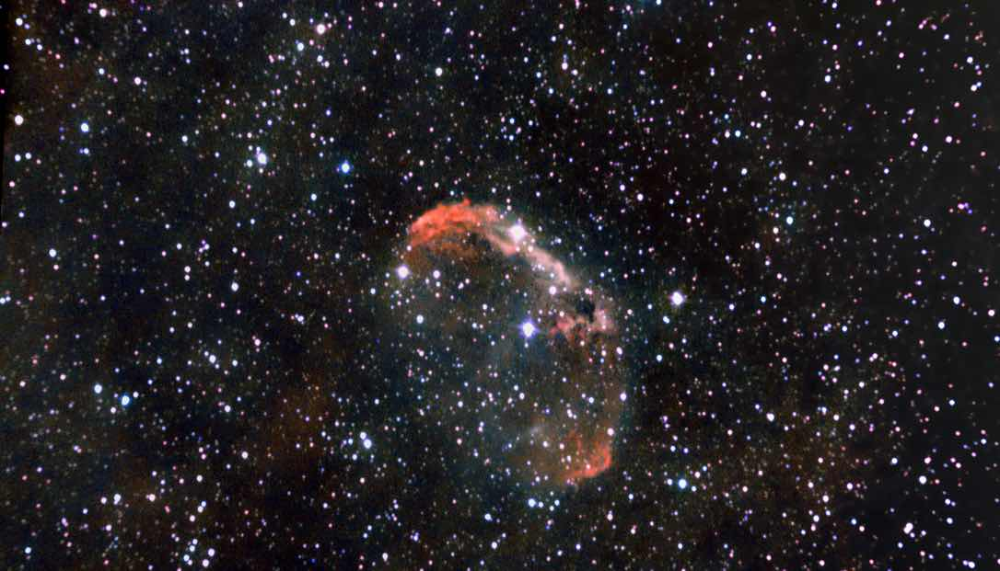

# Informations

The Crescent Nebula (also known as NGC 6888, Caldwell 27, Sharpless 105) is an emission nebula in the constellation Cygnus, about 5000 light-years away. It was discovered by Friedrich Wilhelm Herschel in 1792. It is formed by the fast stellar wind from the Wolf-Rayet star WR 136 (HD 192163) colliding with and energizing the slower moving wind ejected by the star when it became a red giant around 250,000 to 400,000 years ago. The result of the collision is a shell and two shock waves, one moving outward and one moving inward. The inward moving shock wave heats the stellar wind to X-ray-emitting temperatures.

The outer shell of the Crescent Nebula is about 25 light-years across and is expanding at about 20 km/s. The estimated age of the nebula is about 250,000 years. The star responsible for the nebula is a Wolf-Rayet star, WR 136. The star is shedding its outer envelope in a strong stellar wind, ejecting mass at a rate of 10^-5 solar masses per year. The nebula is about 25 arcminutes across, corresponding to a diameter of 18 light-years.

This nebula basically is a dying star that is shedding its outer envelope in a strong stellar wind. In the end it will explode in a supernova.

Here is another processing of the crescent nebula with a different color balance:

# Photo details

📷 Camera: ZWO ASI 585mc pro

🔭 Scope: Quattro 150p

⚙️ Mount: Celestrong cg-5 goto

⏱ Exposure: 180s x 31

🌌 ISO: 200

🌇 Bortle: 7

🖥 Processing: DeepSkyStacker, Siril, Starnet ++

# Comments

Very happy with the result, I didn't expect to be able to see that well the shape of the nebula. This target is very hard in a polluted bortle 7 sky since it's am emission nebula. I think I will try to shoot it again after getting a narrowband filter, making the nebula pop even more.
