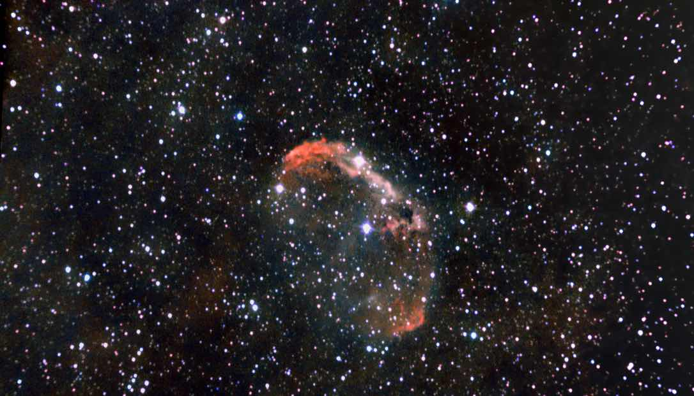

# Informations

This is my second try of the crescent nebula, this time using a dual narroband filter which makes a huge difference. This dual narroband filter is a combination of a hydrogen alpha and oxygen III filter, it allows me to capture the nebula in a bortle 7 sky. This filter reduces a lot of light pollution and allows me to capture the nebula in a way I couldn't before. 

Here is for comparaison the first try I did of the crescent nebula without the filter:

 

As you can see the nebula is way more visible with the filter, the shape is more defined and the colors are more vibrant. 

# Photo details

📷 Camera: ZWO ASI 585mc pro

🔭 Scope: Quattro 150p

🎯 Guiding: ZWO ASI 120mm mini monochrome + SVBONY SV106 guidescope

⚙️ Mount: Celestrong cg-5 goto

🎨 Filter: SVBony 220 dual narrowband filter

⏱ Exposure: 300s x 39

🌌 ISO: 252

🌇 Bortle: 7

🖥 Processing: DeepSkyStacker, Siril, Starnet ++

