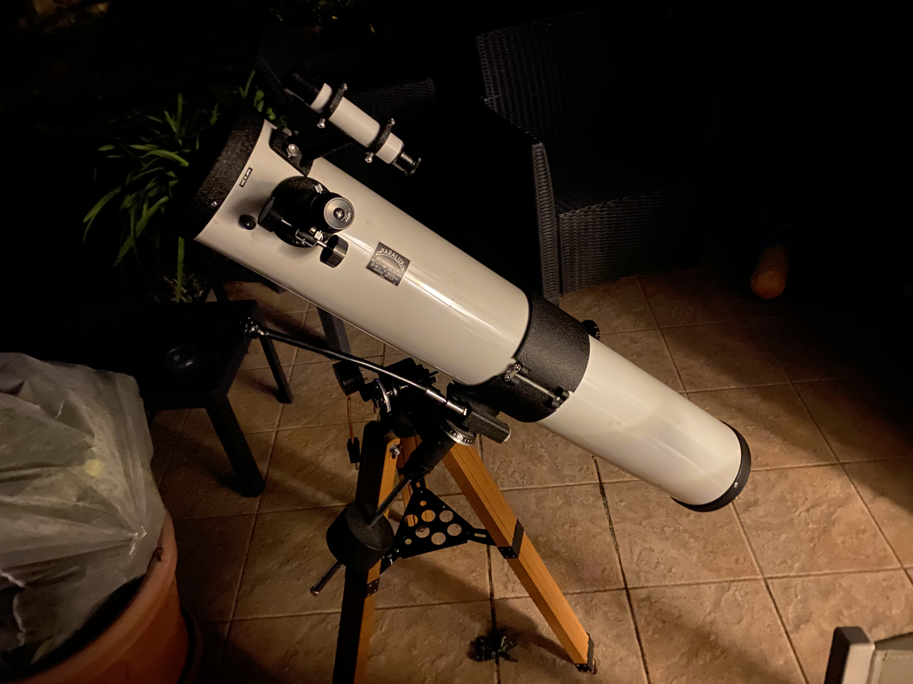
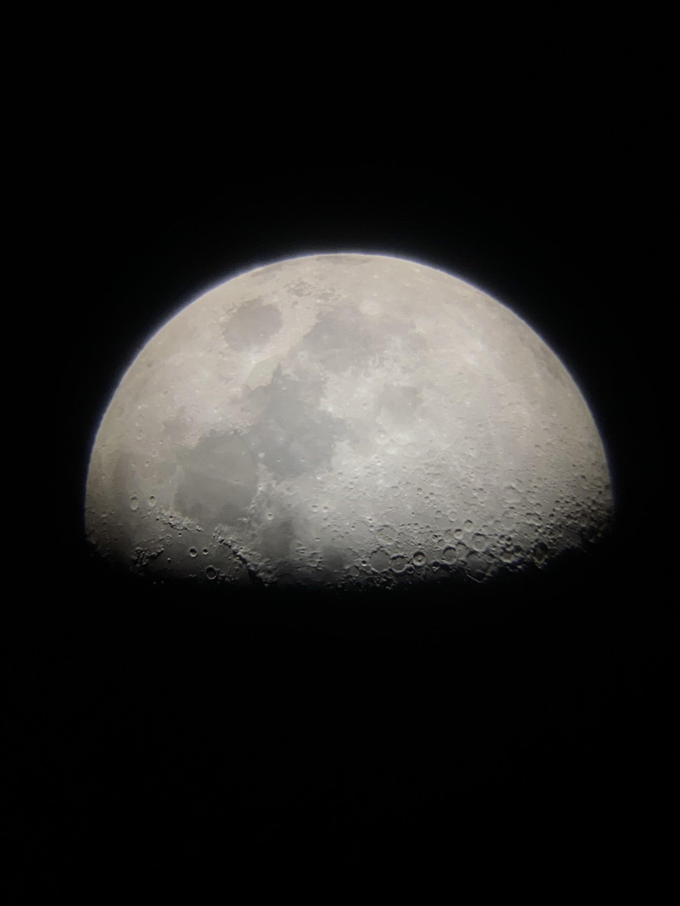
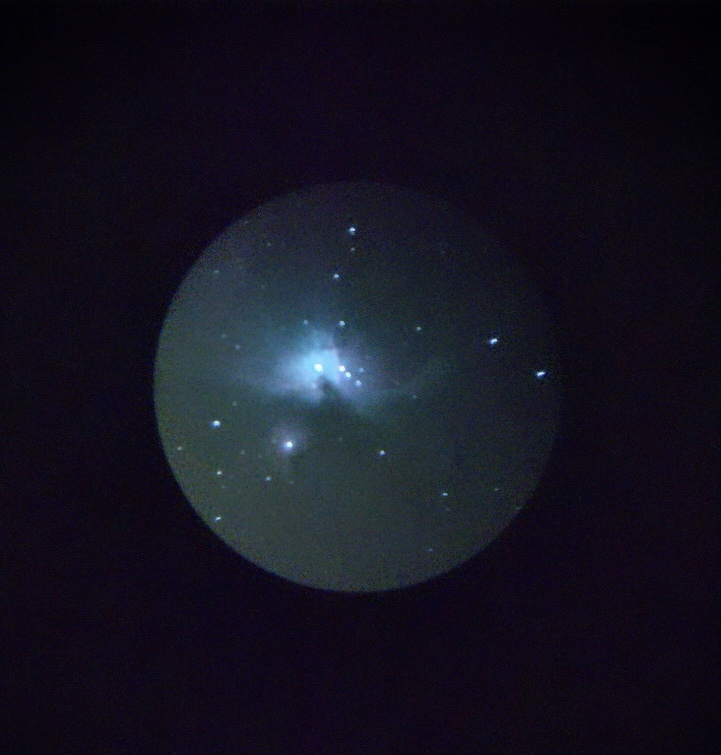
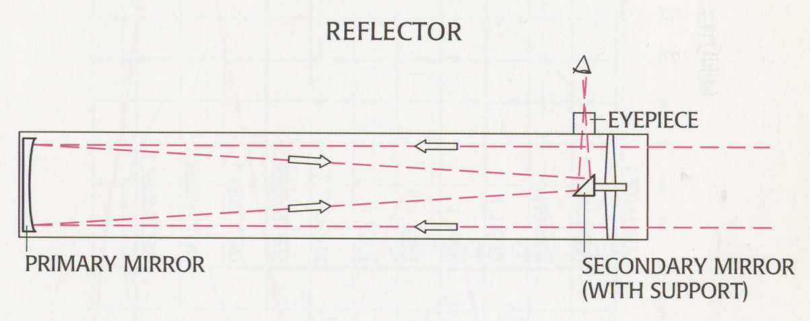
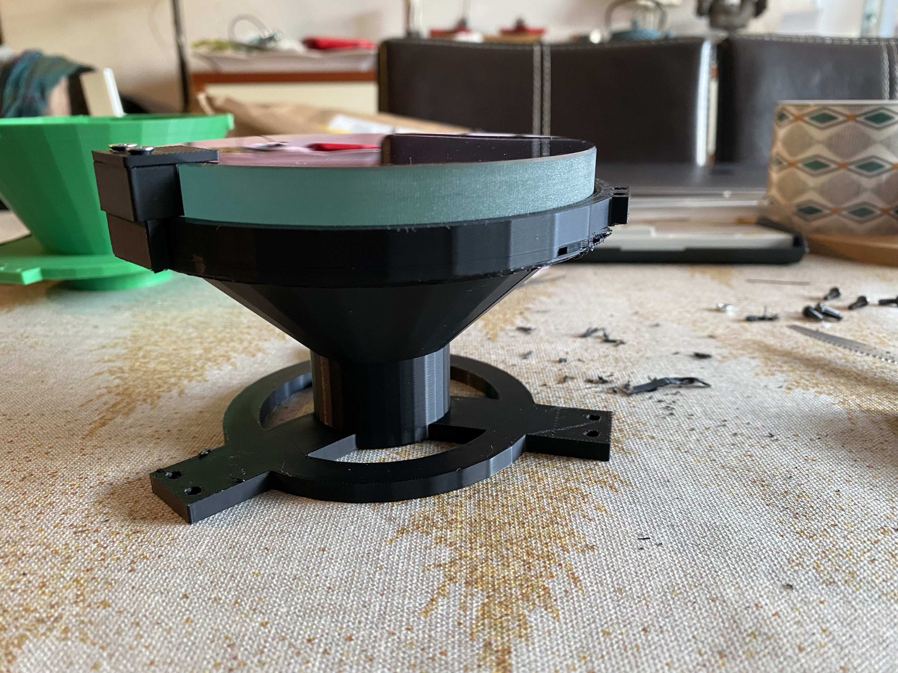
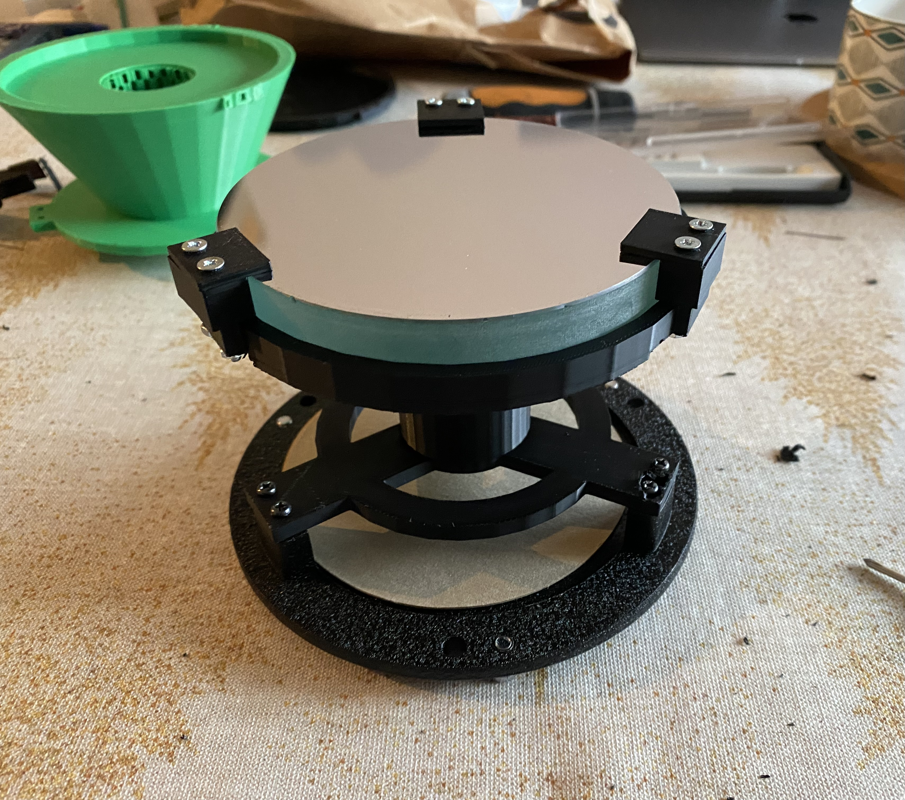
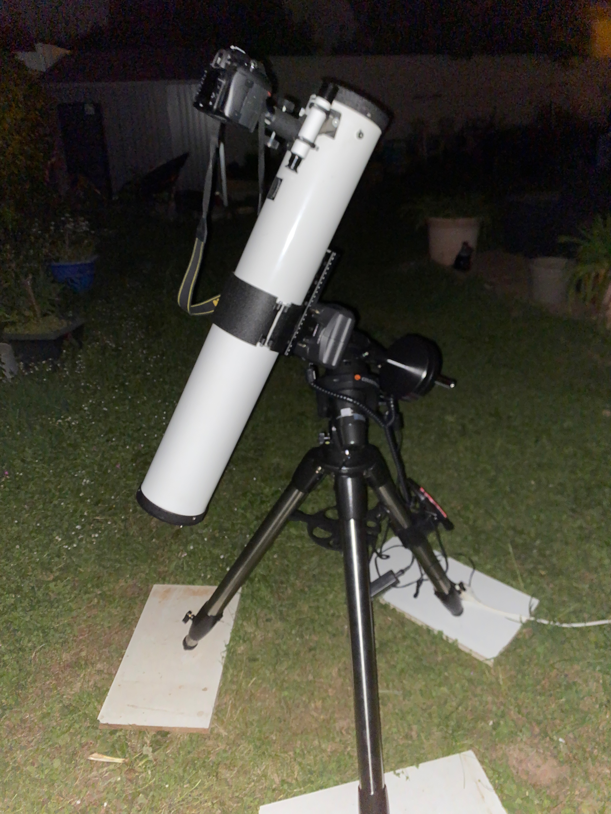

Here is my current setup, I have been trying to limit the budget as much as possible. This low budget allows me to learn a lot more and do some DIY customizations.

## Original mount

The base scope is an old Paralux 114/900 scope, it is a Newtonian reflector with a 114mm aperture and 900mm focal length. The original mount was a wooden equatorial mount with a clock drive. This setup is 40 years old since it was my father's scope when he was a kid.

The main problem with this mount was the fact I couldn't use a DSLR camera with it. The scope would not focus on the camera sensor. I started to take pictures using my phone and a phone adapter. The results were not great but it was a start.

 

## Primary mirror upgrade

To achieve the focus with a DSLR camera I had to move the primary mirror up the tube. But first let's see how a newtonian scope works.

The principle is simple, the light enters the tube and is reflected by the primary mirror to the secondary mirror. The secondary mirror reflects the light to the eyepiece. The eyepiece is placed at the focal point of the primary mirror. The distance between the primary mirror and the eyepiece is the focal length of the scope.

This type of scope have been invented by Isaac Newton in 1668. The main advantage of this design is the fact that the light is reflected only once. This means that the light is not absorbed by the tube walls. This is why this type of scope is very good for deep sky objects.

Adding a DSLR to the setup means that the camera sensor has to be at the focal point of the primary mirror. Camera sensors are at the back of the camera body. This means that the primary mirror has to be moved up the tube to bring back the focus point on the camera sensor.

Another option was to use a Barlow lens to increase the focal length of the scope. This would have allowed me to use the camera without moving the primary mirror. But this would have increased the focal length of the scope to 1800mm. This would have made the scope less versatile and would have required a more precise tracking. It would also have lower the field of view of the camera and the light gathering power of the scope which is not ideal for deep sky objects.

To move the primary mirror I had to self design a custom piece using Blender. After a few iterations I came up with a design that would allow me to move the primary mirror up the tube by roughly 6 centimeters. This would allow me to focus on the camera sensor.

 

Using this upgrade I managed to capture the Orion nebulae with my DSLR camera. Here is the best image I managed to get after acquiring data on multiple nights.

the full post is available [here](https://astro.thomas-mauran.com/p/orion-nebulae-10-04-2024/)

## New Goto mount

The next step was to upgrade the mount. The old mount was not very stable and the clock drive was not very precise. I tried multiple times to find Messier 51 but never managed to get it, living in a bortle 6-7 zone doesn't help either.

I managed to get a second hand Celestron cg-5 goto mount- for 400 euros which is a great deal ! This mount is a lot more stable and precise. It also has a goto system that allows me to find objects in the sky. This is a game changer for me since I can now find objects in the sky without having to spend hours looking for them.

The goto systems works by aligning the mount with the sky. The mount has to be aligned with 3 stars. The mount then knows where it is pointing in the sky. The mount can then move to any object in the sky. This is very useful for deep sky objects since they are very hard to find.

I tried to shoot Messier 51 with this new cg5 and got this shot which is a pretty good start overall !

the full post is available [here](https://astro.thomas-mauran.com/p/messier-51-24-04-2024/)

## Next steps 

The next step is to get more experience with the mount and especially a betterpolar alignement. Right now star trails don't let me go further than 15", I will have to improve this to get longer exposures. I also plan to get a guiding scope in the future to get even longer exposures up to 300" which seems to be the sweet spot for deep sky objects. Guiding scopes are used to correct the mount tracking in real time by locking a star in the field. This is very useful for long exposures since the mount is not perfect and will drift over time.