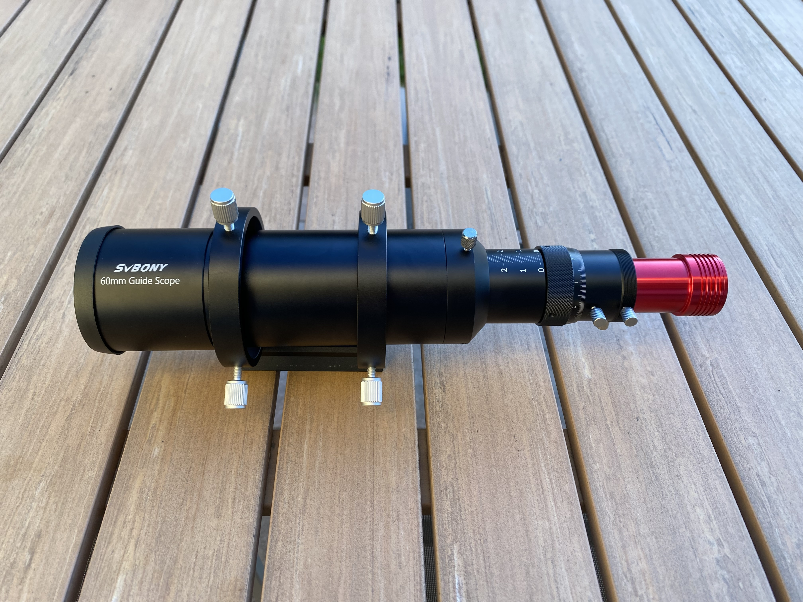
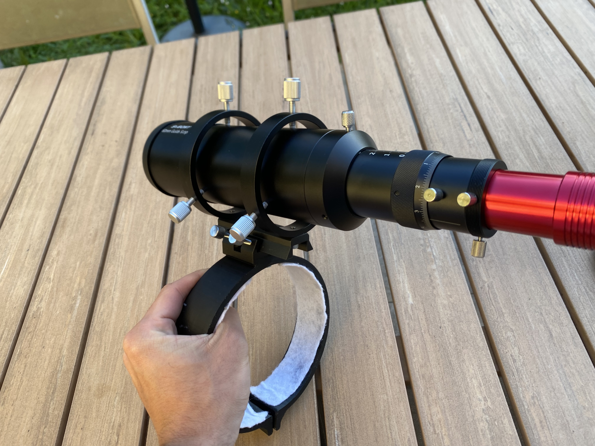
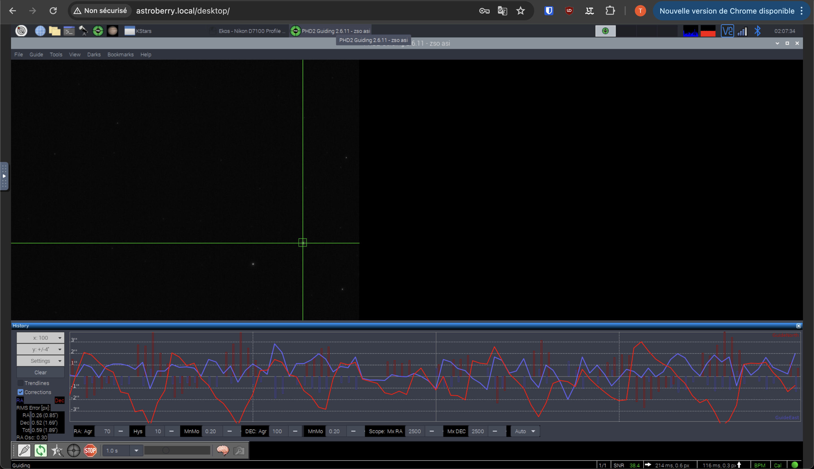
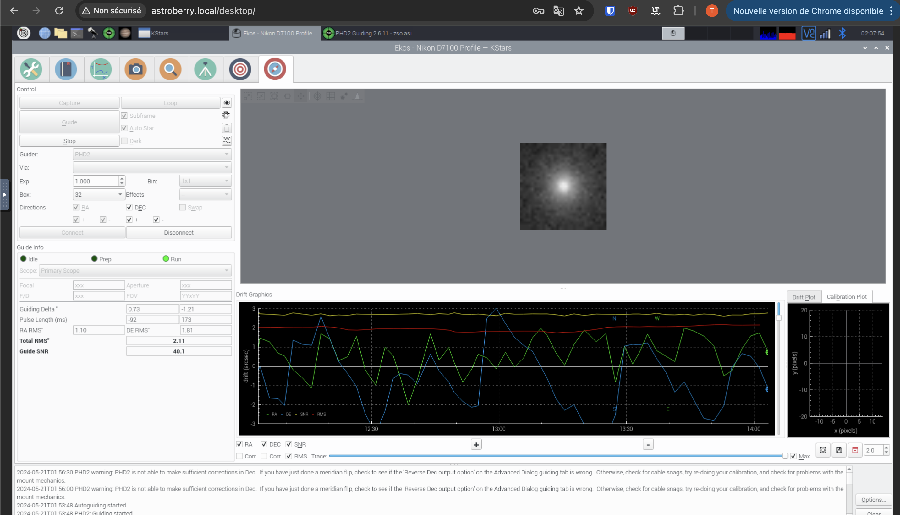

## Description

When doing astrophotography one main thing to consider is the signal to noise ratio. The more light you can capture the better the image will be. To achieve this, you need to have long exposure times allowing you to reduce the ISO and get a cleaner image with less noise in the end. The problem is that the Earth rotates, and the stars move in the sky. This means that if you want to have long exposure times you need to track the stars.

My current goto mount allows me to reach up to 30 seconds of exposure time without guiding. This is good for some objects, but for deep sky objects, I need to have longer exposure times to really reduce the noise. To achieve this I need to guide the mount. This means that I need to have a second smaller telescope that will track a star and send corrections to the mount to keep the star in the same position.

This method is called guiding and is essential for deep sky astrophotography. I recently upgraded rig to include a guide scope but my 114/900 behing quite an uncommon telescope for deepsky imaging I had to overcome some challenges to make it work.

## How does guiding work ?

As said previously guiding is the process of tracking a star and sending corrections to the mount to keep the star in the same position. This is done by taking short exposures of the star and comparing the position of the star in the frame to a reference position. If the star is moving, the guiding software will send corrections to the mount to keep the star in the same position.

To do so you have multiple options but the most common one is to use a guide scope coupled with a guide camera and a software called PHD2 (Push Here Dummy).

Before purshasing anything you need to consider multiple options with both advantages and drawbacks.

### What guidescope to choose ?

A common rule to choose an adapted guide scope is to have a focal length of 1/3 to 1/2 of the main telescope. This is to ensure that the guide scope will have a wider field of view than the main telescope. This is important because the guide scope needs to be able to see enough stars to track one.

In my case my telescope has a focal length of 900mm so I needed a guide scope with a focal length between 300mm and 450mm. I chose a 60/240 guide scope with good reviews, the SVBONY SV106.

### What guide camera to choose ?

The main astro camera brand is zwo, their product are used by a lot of astrophotographers and are known for their quality. I chose the ZWO ASI120MM Mini, a monochrome camera with a good sensitivity and a high frame rate.

You either can choose a monochrome camera or a color camera. The main difference is that a monochrome camera will be more sensitive and will allow you to take shorter exposures. This is important because the shorter the exposure the less the star will move in the frame and the more accurate the guiding will be. In my case I chose a monochrome camera because I wanted to have the best guiding possible.

## My 3D printed holder

As mentionned before my telescope is quite uncommon for deep sky imaging. His diameter of 140mm is uncommon meaning I often have to make custom parts to make it work. This time I had to make a custom holder for the guide scope. I managed to find a 3D model for a 8" newtonian telescope and I modified it to fit my telescope. 

I printed the holder in PLA and glued a small cloth to the inside to avoid scratching the telescope. I ordered a dovetail mount to attach the guide scope to the holder. 

The 3D printed holder turned out perfect but the holes were too small for the screws I found. To avoid printing the whole part again I used a drill to make the holes larger. I only had to screw the holder to the telescope and the guide scope to the holder.

 

After confirming everything was sturdy enough I attached the whole scope and camera to the holder. I then had to adjust the focus of the guide scope to get a sharp image of the stars.

And here is what it looks like when everything is attached to the telescope.

## PHD2 setup

The last step was to setup PHD2. I had to connect the camera to the raspberry pi and to the mount. When you first start PHD2 you need to make a dark library. This is done by taking multiple dark frames and saving them in a folder. This is used to subtract the noise from the guiding frames.

You can then start to find the focus of the guide scope. This is done by taking short exposures and adjusting the focus until the stars are sharp. This is very important because if the stars are not sharp the guiding will not be accurate.

I then had to calibrate the camera to make sure the guiding was accurate. This is done by taking short exposures of a star and comparing the position of the star in the frame to a reference position. The software will then send corrections to the mount to keep the star in the same position.

 

## Conclusion

With the new guide scope I can now reach up to 300 seconds of exposure time. This is a huge improvement over the 30 seconds I could reach before. This means that I can now take much cleaner images with less noise (around 200 iso instead of 6400). I am very happy with the results and I can't wait to take more images with the new setup.
