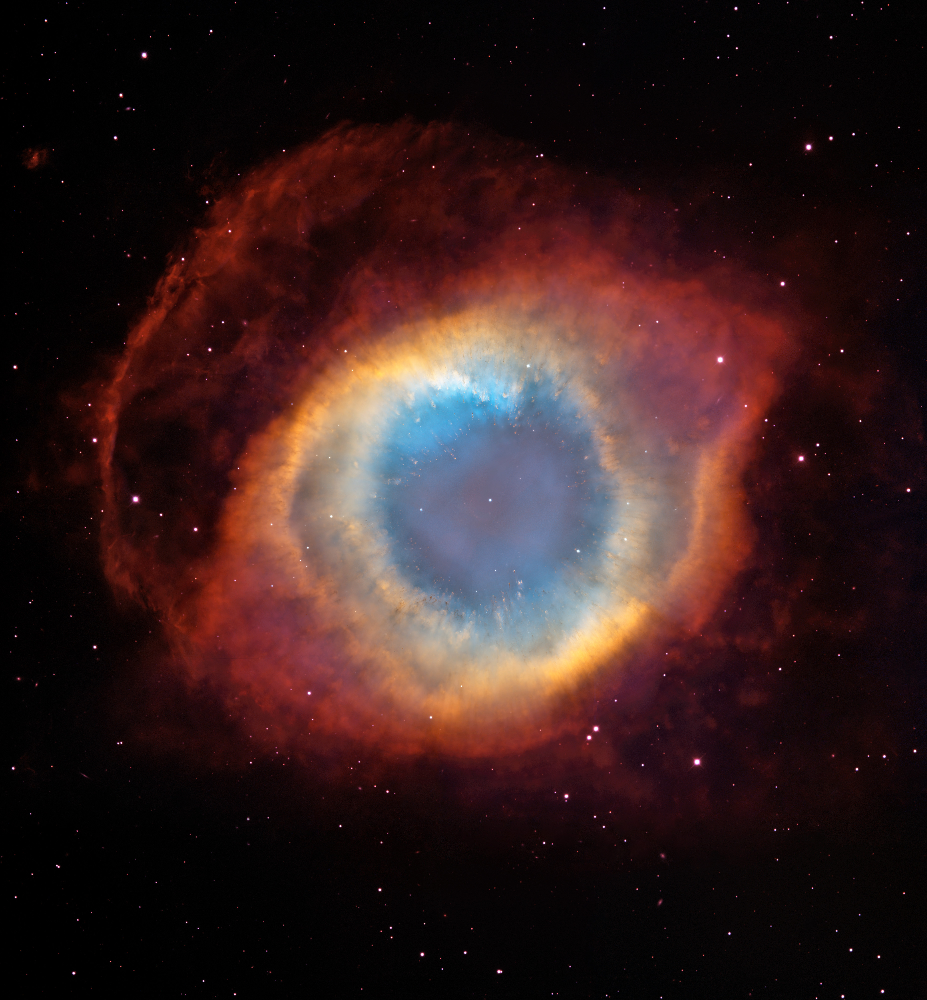

# Informations

The Helix nebula, also known as NGC 7293, is a planetary nebula located in the constellation Aquarius. It is one of the closest planetary nebulae to Earth, lying at a distance of about 700 light-years. This nebula has some very bright colors with a magnitude of 7.3, making it a popular target. The hard part when photographing the Helix is the fasct it reside in a very low part of the sky and doesn't rise very high.

When looking at the center of the Helix nebula, you can see a white dwarf star, which is the remnant of the star that created the nebula. The white dwarf is surrounded by a ring of gas and dust, which is illuminated by the ultraviolet radiation from the star. The nebula is expanding at a rate of about 40 km/s, and it is estimated to be about 2.5 light-years in diameter.

The color grading we see in the Helix nebula comes from the different elements present in the gas and dust. The red color comes from hydrogen gas, while the blue-green color comes from oxygen gas.

This might be one of my favorite nebulae in the night sky

Here is for comparaison my 3 hours shot compared to hubble's picture:

 

Obviously less details but we clearly see the global features being present.    

# Photo details

📷 Camera: ZWO ASI 585mc pro

🔭 Scope: Quattro 150p

🎯 Guiding: ZWO ASI 120mm mini monochrome + SVBONY SV106 guidescope

⚙️ Mount: Celestrong cg-5 goto

🎨 Filter: SVBony 220 dual narrowband filter

⏱ Exposure: 300s x 42

🌌 ISO: 265

🌇 Bortle: 7

🖥 Processing: DeepSkyStacker, Siril, Starnet ++, Astrosharper, Photoshop

