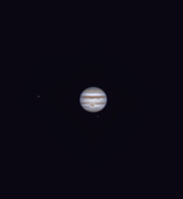

# Informations

Jupiter is the fifth planet from the Sun and the largest in the Solar System. It is a gas giant with a mass one-thousandth that of the Sun, but two-and-a-half times that of all the other planets in the Solar System combined. Jupiter is one of the brightest objects visible to the naked eye in the night sky and has been known to ancient civilizations since before recorded history. It is named after the Roman god Jupiter. When viewed from Earth, Jupiter can be bright enough for its reflected light to cast shadows, and is on average the third-brightest natural object in the night sky after the Moon and Venus.

## Comment 

This is my first try at jupiter, considering my setup is made for DSO and not planetary I am already very impressed with the result. My small focal length makes it hard to get a lot of details I will invest in a decent barlow lens in the future to get more details.

# Photo details

📷 Camera: ZWO ASI 585mc pro

🔭 Scope: Quattro 150p

🎯 Guiding: None

⚙️ Mount: Celestrong cg-5 goto

🎨 Filter: SVBony 220 dual narrowband filter

⏱ Exposure: 7 min video stacked (22000 frames)

🌌 ISO: 265

🌇 Bortle: 7

🖥 Processing: Siril, Starnet ++, Graxpert, Photoshop

