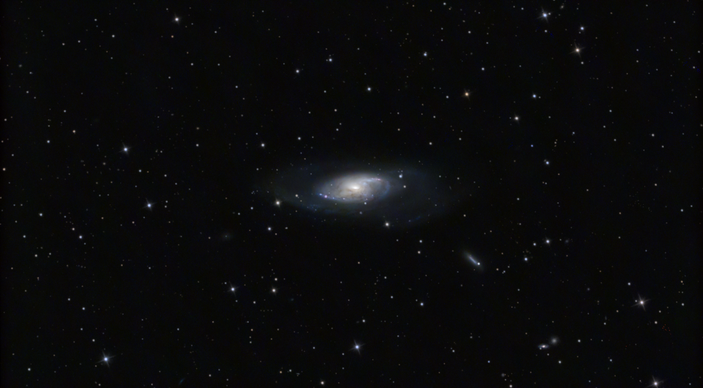

# Informations

Messier 106 (also known as NGC 4258) is a spiral galaxy in the constellation Canes Venatici. It was discovered by Pierre Méchain in 1781. M106 is at a distance of about 22 to 25 million light-years away from Earth. It is also a Seyfert II galaxy, which means that due to x-rays and unusual emission lines detected, it is suspected that part of the galaxy is falling into a supermassive black hole in the center.

# Photo details

📷 Camera: ZWO ASI 585mc pro

🔭 Scope: Quattro 150p

🎯 Guiding: ZWO ASI 120mm mini monochrome + SVBONY SV106 guidescope

⚙️ Mount: Celestrong cg-5 goto

🎨 Filter: UV/IR Cut filter

⏱ Exposure: 20s x 1850

🌌 ISO: 255

🌇 Bortle: 7

🖥 Processing: DeepSkyStacker, Siril, Starnet ++, Astrosharper, Photoshop

