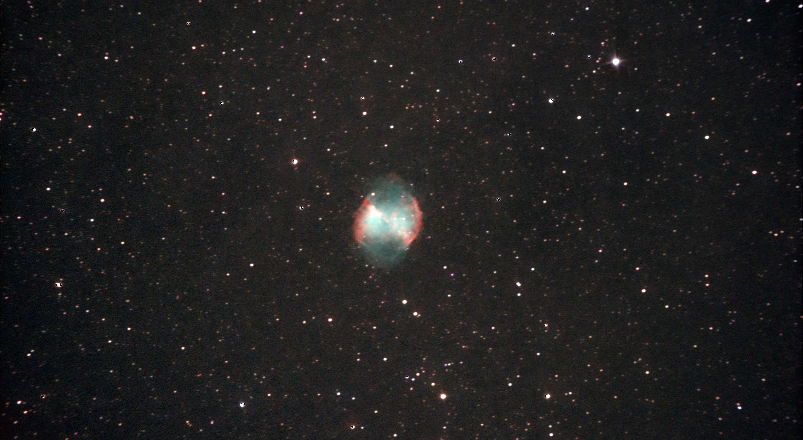

# Informations

The Dumbbell Nebula (also known as Apple Core Nebula, Messier 27, M 27, or NGC 6853) is a planetary nebula in the constellation Vulpecula, at a distance of about 1,360 light-years. This object was the first planetary nebula to be discovered; by Charles Messier in 1764. At its brightness of visual magnitude 7.5 and its diameter of about 8 arcminutes, it is easily visible in binoculars, and a popular observing target in amateur telescopes.

Planetary nebulae represent the final brief stage in the life of a medium-sized star like our Sun. While consuming the last of the fuel in its core, the star expels a large portion of its outer envelope. This material then becomes heated by the radiation from the stellar remnant and radiates, producing glowing clouds of gas that can show complex structures, as the eponymous dumbbell shape of M 27 shows.

# Photo details

📷 Camera: ZWO ASI 585mc pro

🔭 Scope: Quattro 150p

🎯 Guiding: ZWO ASI 120mm mini monochrome + SVBONY SV106 guidescope

⚙️ Mount: Celestrong cg-5 goto

⏱ Exposure: 30s x 30

🌌 ISO: 200

🌇 Bortle: 7

🖥 Processing: DeepSkyStacker, Siril, Starnet ++

# Comments

This is my first light with my brand new quattro 150p and my new ZWO camera and I am so happy with the result.
In only 15 minutes I was able to capture my best picture yet showcasing beautiful colors and details of the nebula. I can't wait to see what I can do with more time and experience. 

We see that the picture is still blurry and got some noise but this is a matter of time and experience.