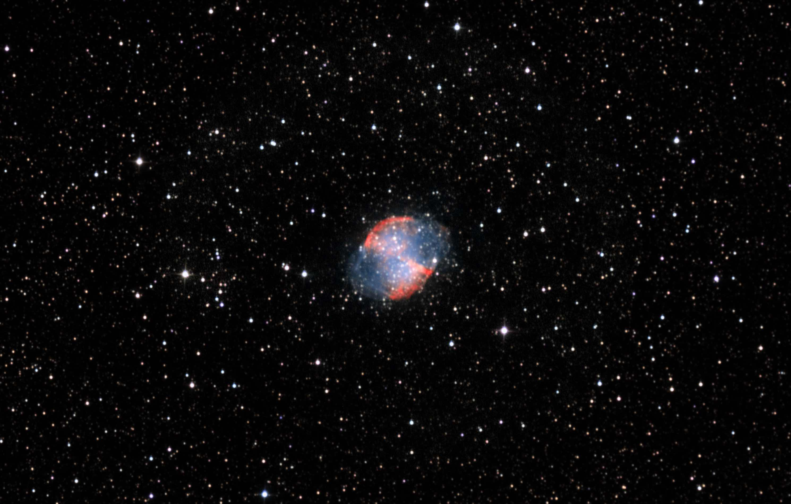
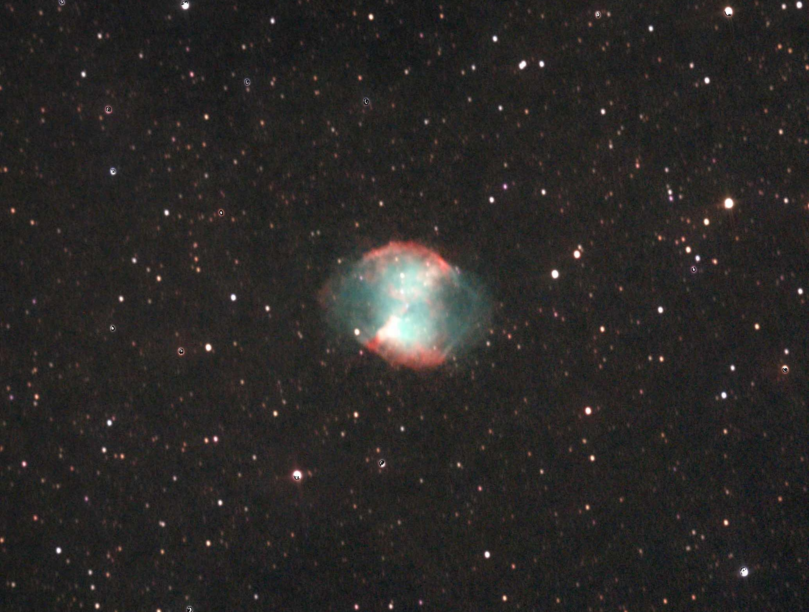

# Informations

To get more information about the Dumbell Nebula, you can check the [previous post](/p/dumbell-nebula-m27-06-09-2024/).

This is my second attempt at the Dumbbell Nebula, I wanted to try to get a better picture of it and the result turned out great. Overall I managed to get way more data and learn a lot of new processing techniques. 

Here is a side to side comparison of the two pictures:

 

# Photo details

📷 Camera: ZWO ASI 585mc pro

🔭 Scope: Quattro 150p

⚙️ Mount: Celestrong cg-5 goto

⏱ Exposure: 180s x 50

🌌 ISO: 200

🌇 Bortle: 7

🖥 Processing: DeepSkyStacker, Siril, Starnet ++
