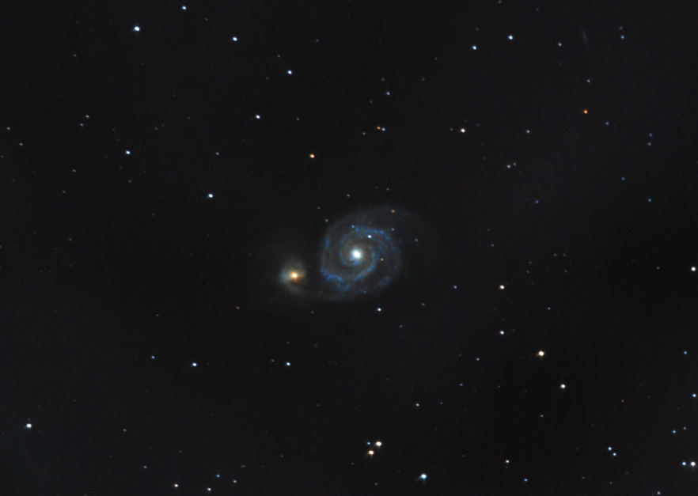

# Informations

Here is a new shot of M51 with the new guide scope and guide camera. I am very happy with the result, the image is much cleaner than the previous one. The 180s subs allowed me to capture the same amount of data but reduce the iso by 16 times.

# Photo details

📷 Camera: Nikon D7100

🔭 Scope: Paralux 114/900

⚙️ Mount: Celestrong cg-5 goto

🎯 Guiding: ZWO ASI 120mm mini monochrome + SVBONY SV106 guidescope

⏱ Exposure: 180s x 45 ~ 2h15

🌌 ISO: 400

🌇 Bortle: 7

🖥 Processing: DeepSkyStacker, Siril
