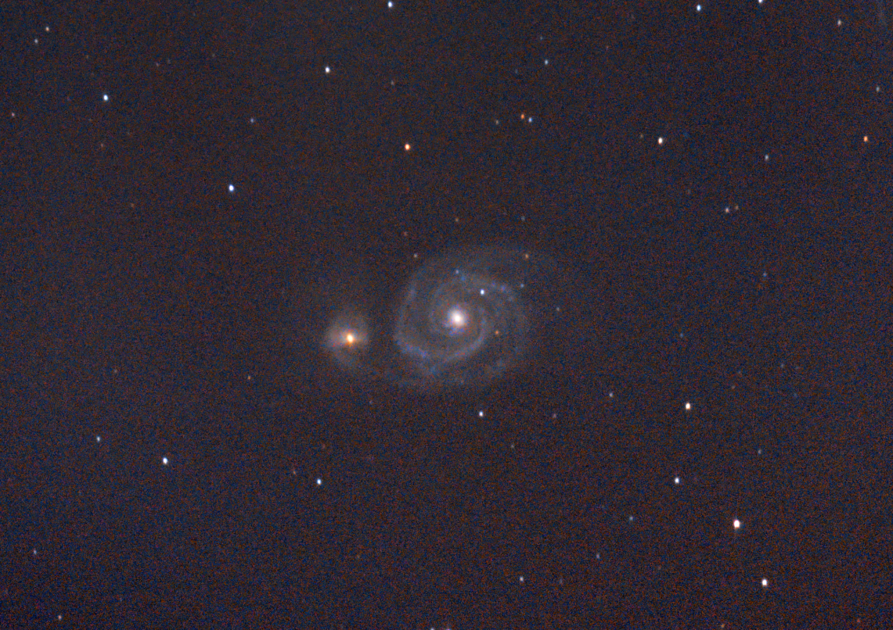

# Informations

Messier 51 (M51), also known as the Whirlpool Galaxy, is a grand-design spiral galaxy in the constellation Canes Venatici. It lies at an approximate distance of 30.5 million light years from Earth. The galaxy has an apparent magnitude of 8.4 and occupies an area of 11.2 by 6.9 arc minutes of apparent sky, which corresponds to a linear diameter of about 60,000 light years. The Whirlpool Galaxy is one of the most famous galaxies in the sky and is best known for its interaction with its companion galaxy, NGC 5195.

# Photo details

📷 Camera: Nikon D7100

🔭 Scope: Paralux 114/900

⚙️ Mount: Celestrong cg-5 goto

⏱ Exposure: 15s x 150

🌌 ISO: 4000 - 6400

🌇 Bortle: 7

🖥 Processing: DeepSkyStacker, Siril, Photoshop

# Comments

My image still has a lot of noise, I will try to reduce it in the next images by taking more pictures and longer ones to reduce the ISO.