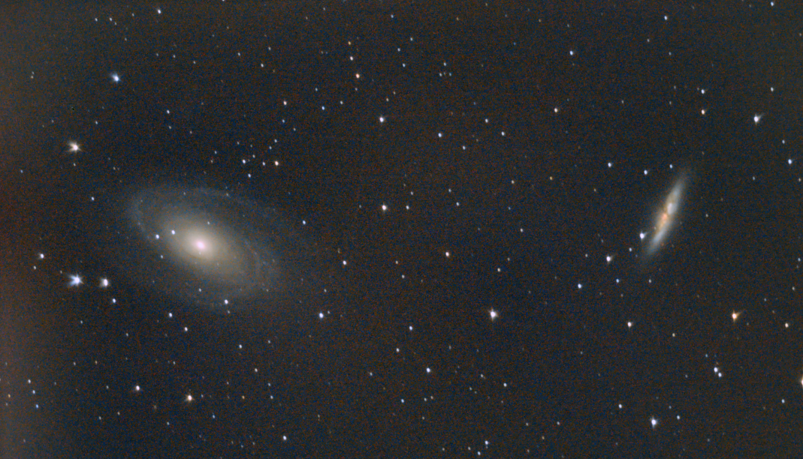

# Informations

Messier 81 and Messier 82 are two galaxies in the constellation Ursa Major. They are located at a distance of 12 million light years from Earth. M81 is a grand design spiral galaxy and M82 is an irregular galaxy. M81 has an apparent magnitude of 6.9 and M82 has an apparent magnitude of 8.4. M81 is about 90,000 light years across and M82 is about 37,000 light years across. M81 and M82 are interacting with each other, M82 is distorting M81's spiral arms.

M82 got this shape because of the gravitational interaction with M81. The gravitational forces between the two galaxies are pulling the stars and gas in M82 towards M81. This is causing the gas in M82 to be compressed and heated up. This is causing the gas to emit a lot of light in the infrared and ultraviolet spectrum. This is why M82 is a starburst galaxy.

# Photo details

📷 Camera: Nikon D7100

🔭 Scope: Paralux 114/900

⚙️ Mount: Celestrong cg-5 goto

⏱ Exposure: 10s x 300

🌌 ISO: 6400

🌇 Bortle: 7

🖥 Processing: DeepSkyStacker, Siril, Photoshop

# Comments

Still a lot of noise on this picture, I was very happy to see the two galaxies in the same field of view. I ordered a guide scope and a guide camera to improve the tracking of the mount. This will allow me to take longer exposures and reduce the ISO.