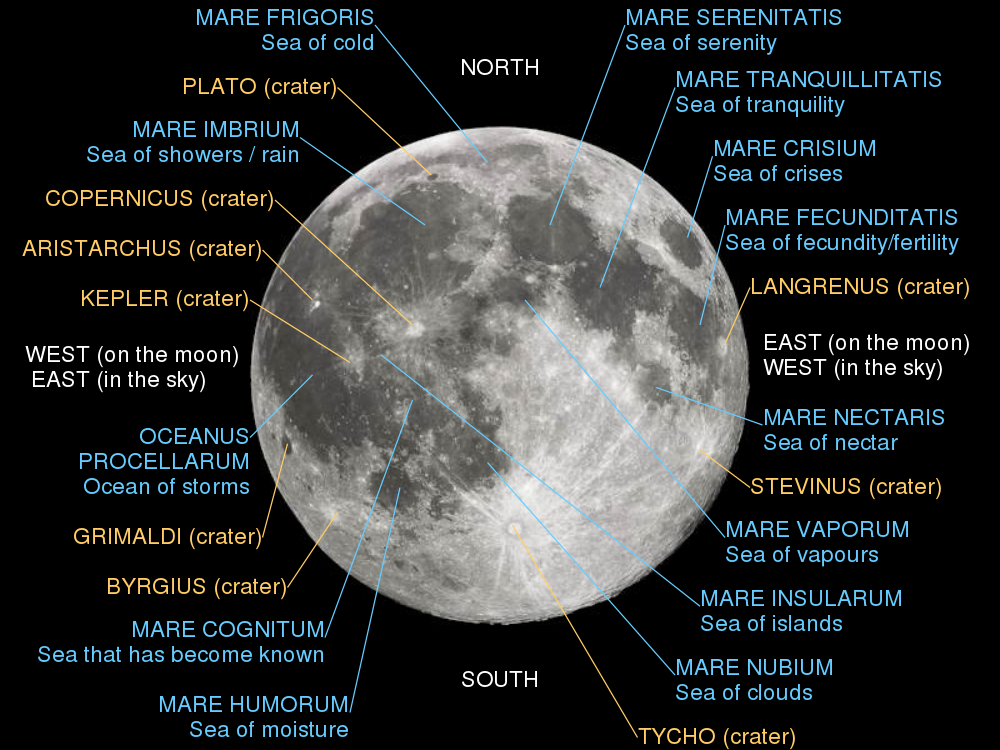

# Informations

Quick picture of the almost full moon. We can clearly see the big Tycho crater in the bottom right of the picture. 

Here is a map of the moon craters :

# Photo details

📷 Camera: Nikon D7100

🔭 Scope: Paralux 114/900

⚙️ Mount: Celestrong cg-5 goto

🌌 ISO: 160

🌇 Bortle: 7

# Comments

I lost a lot of data from my session because of a poor tracking ! I had to discard a lot of pictures. I'm still happy with the result, but I will have to do it again to get a better picture of this galaxy. 
