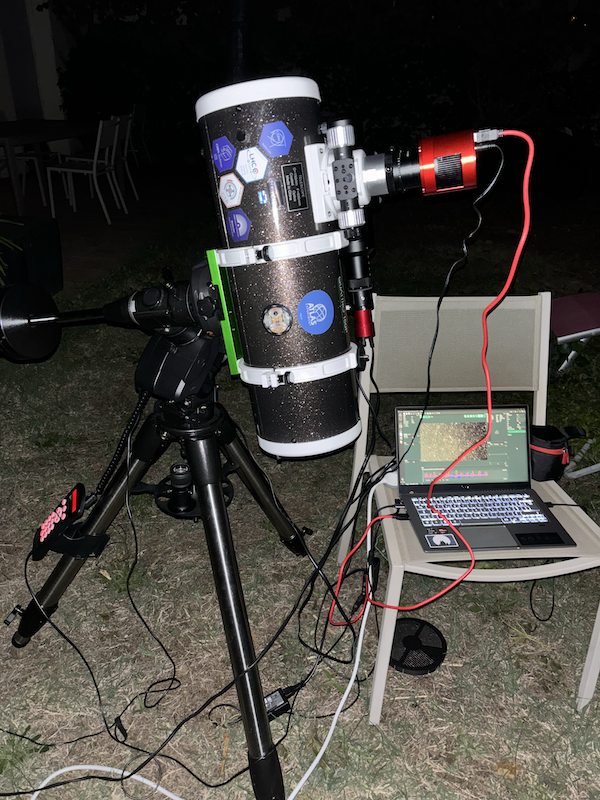
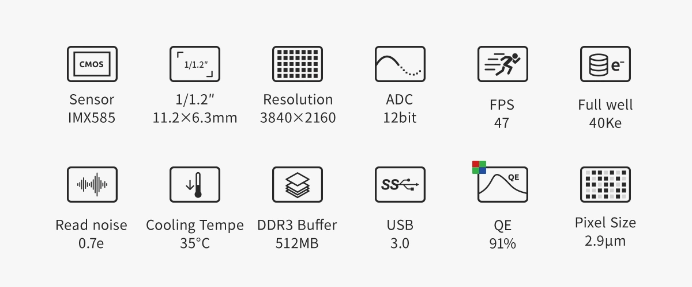

## Upgrade of the rig

I recently invested in a new telescope and dedicated cooled astro camera. This new setup is a game changer for me. 

## New telescope

I live in a bortle 7 zone and my past telescope had a focal ratio of f/8 which is very slow. With a mirror of only 114 mm for a focal length of 900mm. This was not ideal and I had to spend tremendous amount of time to get a decent barely usable picture.

I decided to switch for the skywatcher quattro 150p which has a focal ratio of f/4. This is a huge upgrade for me. The mirror is 150mm for a focal length of 600mm. This means that I can get a lot more light in the same amount of time. I choose this 150/600 instead of a 150/750 because the quattro was providing a 0.85x coma corrector reducing my focal ratio to f/3.4. Another cool thing is that the quattro is less heavy than the 150/750 which is a good thing for my back and for the guiding system.

This scope upgrade makes the new scope 5 times faster than the old one. This means that I can get the same amount of light in 5 times less time.

I didn't want to switch from a newtonian to a refractor because I wanted to take pictures of small objects like galaxies and wanted to have a small focal ratio. The quattro was the perfect choice for me.

## New camera

I also invested in a new camera. I choose the ZWO ASI 585mc pro. This is a cooled camera with a 2.9um pixel size. This camera is a lot more sensitive than my old camera. The cooling system allows me to take pictures at -15°C which is a huge advantage for long exposure pictures. This new camera is also way easier to manipulate to do the 3 star polar alignment and take picture sessions.

I hesitated between the 585mc pro and the 533mc pro which is an older model, the statisitcs looked worse but the field of view of the 533 is wider which is sometimes better. I am very happy with the field of view of the 585mc pro allowing me to shoot narrow objects with a good framing

## Using N.I.N.A instead of ekos

I switched from NINA to ekos and now use a regular laptop instead of my raspberry pi which I have to admit is a lot more stable. I use TeamViewer to control the laptop from my phone which is very convenient. I also use the NINA scheduler which is very useful to plan my nights.

One of the next step is to be able to fully automate the session including the meridian flip which I now have to do manually, making me loose time.

## Filters

Since I now have a dedicated astro camera it is way easier for me to use filters now. I invested in a regular UV/IR cut filter for broadband targets and in the SVBony 220 dual narrowband filter for narrowband targets. This filter was naybe one of the biggest chock for me. I didn't thought it would make such a big difference but the result is just mind blowing.

Here is a comparison of the same picture with and without the filter:

 

The level of details on the same target with the same exposure time is just amazing. I am really looking forward to shoot other nebulas with this filter.

## Conclusion

This new rig is a massive game changer. It is now so much pleasant to take pictures and the results are way better for a minimal amount of time. Overall looking forward to shoot more objects when clear nights will come back.