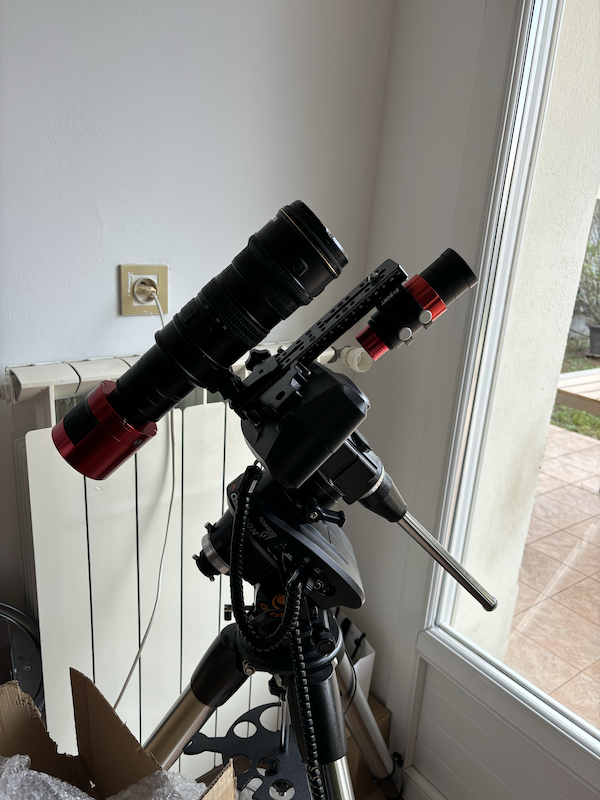
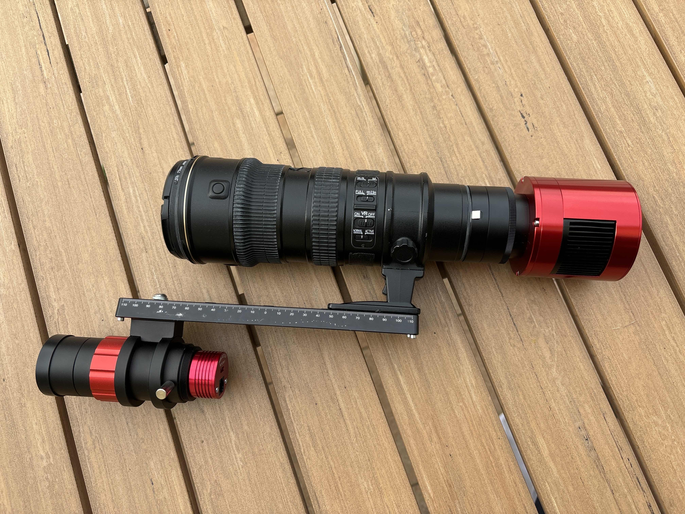

# New gear

I recently acquired a simple new gear to take widefield exposure, as my dad is a great fan of photography we always have had a lot of photo lenses at home, I already tried to take some widefield shots with them such as the [Andromeda](https://astro.thomas-mauran.com/p/andromeda-galaxy/) galaxy but the setup was kind of complicated and not relyable with N.I.N.A. for example.

I found online that you could plug ZWO cameras directly to Nikon lenses using a simple adapter. I already had a Nikon 70-200 f2.8 lens at home so I decided to give it a try. Turns out it's a perfect fit working very well !

I also bought a small guiding scope, the SVBONY SV165, which is very cheap but does the job very well. I mounted it on my ZWO ASI 120mm mini monochrome camera and it's working very well !

With this new gear I am able to see a way greater portiong of the night sky and capture bigger objects such as the Orion nebula or the Rosette nebula and many more !