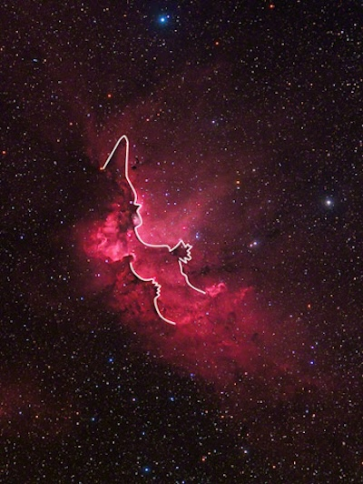
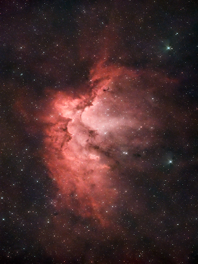

# Informations

The Wizard Nebula, also known as NGC 7380, is an open cluster discovered by Caroline Herschel in 1787. William Herschel included his sister's discovery in his catalog, and labelled it H VIII.77. It is also known as 142 in the 1959 Sharpless catalog (Sh2-142). This reasonably large nebula is located in Cepheus. It is considered to be an open cluster with associated nebulosity. It is about 7,200 light-years away from Earth. 

An open cluster is a group of up to a few thousand stars that were formed from the same giant molecular cloud and have roughly the same age. More than half of the known open clusters lie within the disk of the Milky Way galaxy, with the remainder found in its halo and in the spiral arms.

Here the nebula comes from the ionization of the hydrogen gas by the ultraviolet radiation of the young stars in the cluster. The nebula is a region of star formation, which is a common occurrence in the universe.

It's called the Wizard Nebula because it looks like a wizard with a hat and a staff. The nebula is a beautiful object to observe and to photograph.

Here is the picture with the outlined wizard:

 

# Photo details

📷 Camera: ZWO ASI 585mc pro

🔭 Scope: Quattro 150p

🎯 Guiding: ZWO ASI 120mm mini monochrome + SVBONY SV106 guidescope

⚙️ Mount: Celestrong cg-5 goto

🎨 Filter: SVBony 220 dual narrowband filter

⏱ Exposure: 300s x 29

🌌 ISO: 252

🌇 Bortle: 7

🖥 Processing: DeepSkyStacker, Siril, Starnet ++

